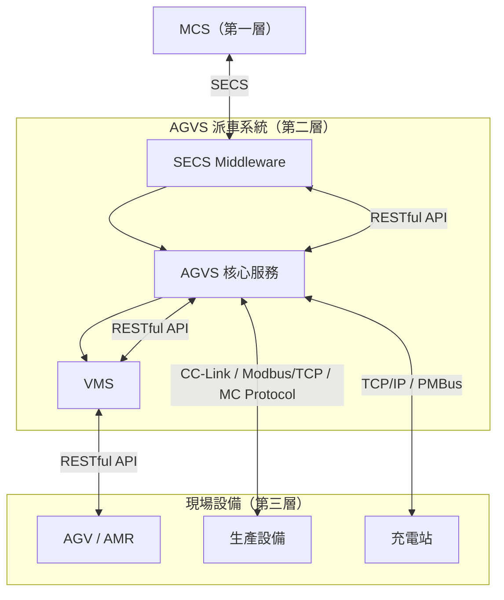
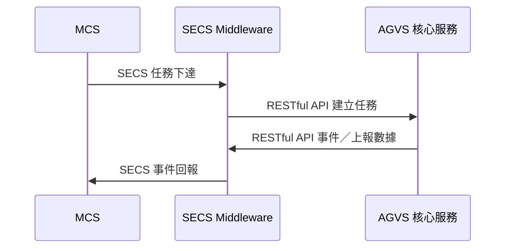
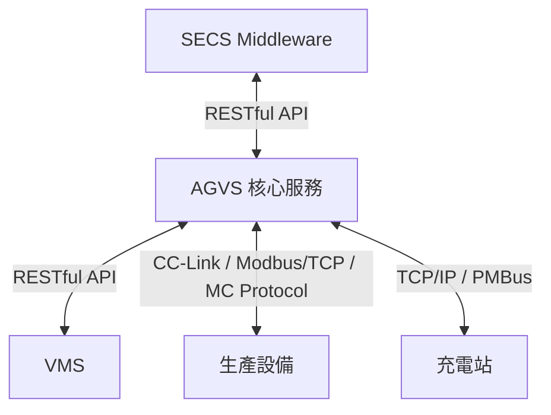

# 模組說明

本頁詳述 [架構概覽](/docs/architecture/overview) 中 **第二層 AGVS 派車系統** 的三個核心服務：各模組職責、對外通訊協定與彼此協作方式。通訊協定細節請參閱 [網路架構拓樸](/docs/architecture/network-topology)。

## 模組關係

## 模組總覽

| 模組 | 所屬層級 | 對外通訊 | 核心職責 |
|------|----------|----------|----------|
| SECS Middleware | 第二層 | MCS（SECS）、AGVS（RESTful API） | 協定轉換、MCS 任務與事件路由 |
| AGVS 核心服務 | 第二層 | SECS Middleware、VMS、前端、生產裝置、充電站 | 任務管理、裝置／充電站管理、前端 |
| VMS | 第二層 | AGVS（RESTful API）、AGV（RESTful API） | 車輛排程、交管、AGV 雙向通訊 |

---

## 1. SECS Middleware

SECS Middleware 是 **MCS 與 AGVS 之間的通訊閘道**，專責 SECS 協定與 AGVS 內部 RESTful API 之間的雙向轉換，不直接管理車輛或現場裝置。

### 子模組職責

| 子模組 | 說明 |
|--------|------|
| SECS 連線管理 | 維護與 MCS 的 SECS Session，處理連線／斷線重連 |
| 訊息轉換 | 將 SECS Message 對映為 AGVS 可理解的任務／事件格式 |
| AGVS API 客戶端 | 主動呼叫 AGVS RESTful API，寫入 MCS 下達的任務 |
| 回報 API 服務 | 提供 RESTful API 供 AGVS 呼叫，接收事件與上報資料 |
| MCS 回報 | 將 AGVS 事件／資料轉換為 SECS 訊息回傳 MCS |

### 通訊介面

| 物件 | 協定 | 方向 | 典型操作 |
|------|------|------|----------|
| MCS | **SECS** | 雙向 | 接收派工指令、回報狀態／事件／完成 |
| AGVS 核心服務 | **RESTful API** | 雙向 | 建立任務、推送事件、轉拋上報資料 |

### 資料流向

:::tip 定位
SECS Middleware 只做 **協定轉換與訊息路由**，任務邏輯、裝置管理、車輛排程均由 AGVS 核心服務與 VMS 負責。
:::

---

## 2. AGVS 核心服務

AGVS 核心服務是派車系統的**業務中樞**，負責任務生命週期、前端操作介面，以及與現場生產裝置、充電站的直接通訊。

### 子模組職責

| 子模組 | 說明 |
|--------|------|
| 任務管理 | 接收任務（來自 SECS Middleware 或 RESTful API），持久化至資料庫，維護任務狀態 |
| 前端服務 | Serve 派車系統 Web 操作頁面，供現場人員監控與操作 |
| 生產裝置管理 | 與客戶端主裝置通訊，讀寫 Port 狀態、Alarm、派車觸發等訊號 |
| 充電站管理 | 監控充電站佔用／空閒，協調低電量 AGV 充電排程 |

### 通訊介面

| 物件 | 協定 | 說明 |
|------|------|------|
| SECS Middleware | **RESTful API** | 接收 MCS 任務、回報事件與上報資料 |
| VMS | **RESTful API** | 提交可執行派車任務、接收車輛執行進度 |
| 生產裝置 | **CC-Link / Modbus/TCP / MC Protocol** | 依機臺 PLC 型別選用，讀寫裝置狀態 |
| 充電站 | **TCP/IP / PMBus** | 充電站連線管理、狀態監控與充電控制 |
| 前端瀏覽器 | **HTTP/HTTPS** | 提供 Web UI |

#### 生產裝置管理 — 支援協定

| 協定 | 適用場景 |
|------|----------|
| CC-Link | 三菱 PLC 為主的裝置網路 |
| Modbus/TCP | 通用工業 PLC，暫存器對映讀寫 |
| MC Protocol | 三菱 MC 協定（乙太網路版） |

#### 充電站管理 — 支援協定

| 協定 | 用途 |
|------|------|
| TCP/IP | 充電站連線、狀態輪詢、充電排程指令 |
| PMBus | 讀取充電模組電壓／電流／狀態等電源管理資訊 |

### 與其他模組的協作

- **上游**：從 SECS Middleware 接收 MCS 任務，確認生產裝置就緒後再派車
- **同層**：將可執行任務交由 VMS 排程 AGV，自身不直接控制車輛移動
- **下游**：直接管理生產裝置與充電站，不依賴 VMS

:::info 分工原則
AGVS 決定 **What & When**（派什麼任務、何時可派）；VMS 決定 **Who & How**（派哪臺車、如何走）。
:::

---

## 3. VMS（Vehicle Management System）

VMS 是**車輛管理與交管系統**，專責 AGV 層級的即時通訊、車輛選派與路徑交管。

### 子模組職責

| 子模組 | 說明 |
|--------|------|
| AGV 通訊 | 以 RESTful API 與 AGV 雙向通訊 |
| 車輛排程 | 依距離、電量、任務優先順序選派最適 AGV |
| 交管 | 多車路徑規劃、衝突偵測、讓路與優先權控制 |
| 狀態匯整 | 彙整 AGV 即時狀態與導航事件，回報 AGVS |

### 通訊介面

| 物件 | 協定 | 方向 | 典型操作 |
|------|------|------|----------|
| AGVS 核心服務 | **RESTful API** | 雙向 | 接收派車請求、回報任務分配與執行進度 |
| AGV | **RESTful API** | 雙向 | 下達任務／移動指令；接收狀態／導航事件 |

#### 與 AGV 的 RESTful 通訊

**下行（VMS → AGV）：**

- 任務指派、移動指令
- 任務取消、暫停／恢復

**上行（AGV → VMS）：**

- 即時位置、電量、執行狀態
- 導航事件（到站、偏離路徑、障礙偵測等）
- 任務執行進度回報

:::caution 注意
VMS 不直接與 MCS、生產裝置或充電站通訊；所有業務指令均來自 AGVS，所有現場裝置協調均由 AGVS 負責。
:::

---

## 模組分工對照

| 專案 | SECS Middleware | AGVS 核心服務 | VMS |
|------|-------------------|---------------|-----|
| MCS 通訊 | ✓（SECS） | — | — |
| 任務持久化 | — | ✓ | — |
| 前端 UI | — | ✓ | — |
| 生產裝置管理 | — | ✓ | — |
| 充電站管理 | — | ✓ | — |
| AGV 排程／交管 | — | — | ✓ |
| AGV 即時通訊 | — | — | ✓（RESTful API） |

---

## 資料持久化

| 模組 | 主要資料 | 說明 |
|------|----------|------|
| AGVS 核心服務 | `tasks` | 派車任務與狀態 |
| AGVS 核心服務 | `equipments` | 生產裝置狀態與對映設定 |
| AGVS 核心服務 | `charging_stations` | 充電站狀態與排程 |
| AGVS 核心服務 | `task_logs` | 任務歷程與稽核 |
| VMS | 車輛即時狀態 | 位置、電量、導航事件（通常為快取或時序資料） |
| SECS Middleware | SECS 對照表 | Message／Event ID 與 AGVS 欄位對映 |

---

## 相關文件

:::info 延伸閱讀
- [架構概覽](/docs/architecture/overview) — 三層架構與服務組成
- [網路架構拓樸](/docs/architecture/network-topology) — 各連線通訊協定
- [派車資料流](/docs/architecture/data-flow) — 任務從 MCS 到 AGV 的完整流程
:::
