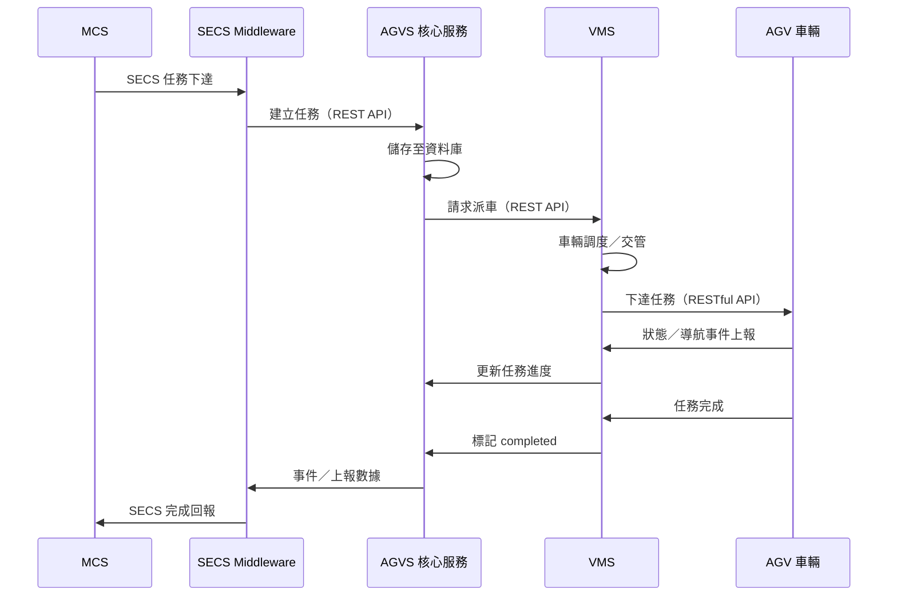
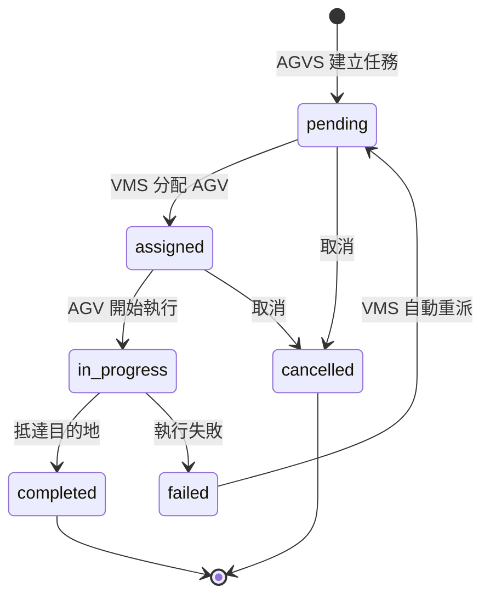

# 派車資料流

以下說明一次完整派車請求從 MCS 下達到 AGV 執行完成的資料流，對應 **MCS → AGVS → AGV** 三層架構。

## 序列圖

## 任務狀態流轉

## 各階段責任

| 階段 | 負責服務 | 動作 |
|------|----------|------|
| 任務接收 | SECS Middleware → AGVS | MCS 任務轉換並寫入資料庫 |
| 派車決策 | AGVS → VMS | AGVS 確認任務可執行，交由 VMS 排程 |
| 車輛執行 | VMS ↔ AGV | 下達移動指令、交管、接收狀態回報 |
| 結果回報 | AGVS → SECS Middleware → MCS | 任務完成事件沿原路徑回傳 |

## 逾時處理

- 任務在 `assigned` 狀態超過 **5 分鐘**未開始 → VMS 自動重派
- 任務在 `in_progress` 超過 **30 分鐘**未完成 → 標記 `failed` 並通知管理員

:::info 相關文件
架構分層說明請參閱 [架構概覽](/docs/architecture/overview)，網路連線請參閱 [網路架構拓樸](/docs/architecture/network-topology)。
:::
