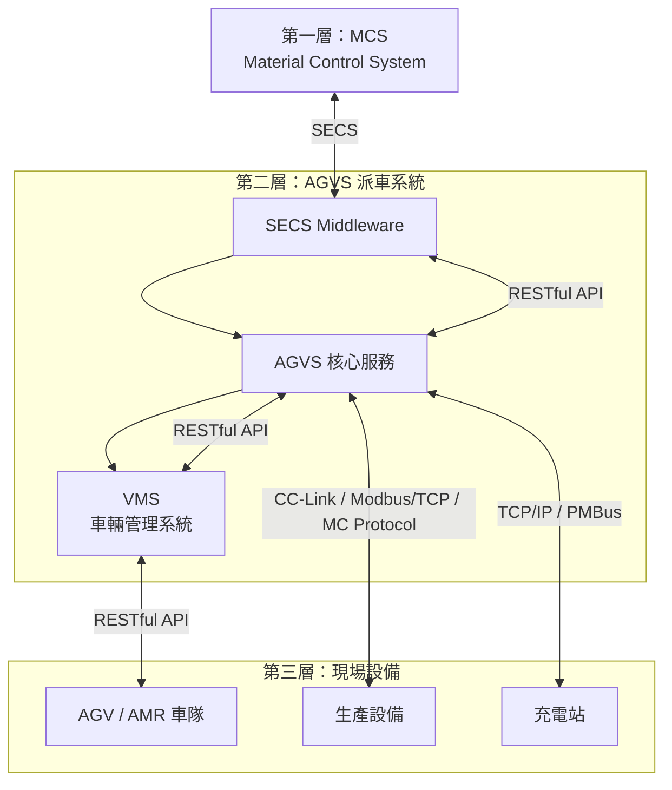
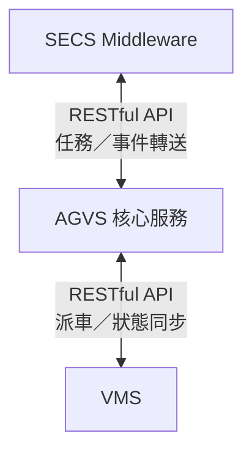
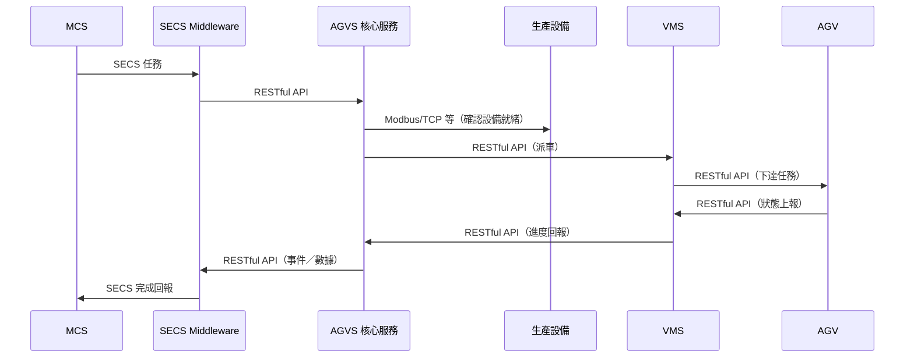

# 網路架構拓樸說明

本頁說明 GPM 派車系統在現場的**網路連線拓樸**，對應 **MCS → AGVS → AGV** 三層架構，並描述各服務與設備之間的通訊協定。

## 拓樸總覽

## 通訊協定一覽

| 連線 | 通訊協定 | 說明 |
|------|----------|------|
| MCS ↔ SECS Middleware | **SECS** | 上位派工、狀態與事件交換 |
| SECS Middleware ↔ AGVS | **RESTful API** | 任務轉送、事件與上報數據交換 |
| AGVS ↔ VMS | **RESTful API** | 派車請求、任務進度與狀態同步 |
| VMS ↔ AGV | **RESTful API** | 任務下達、狀態／導航事件上報 |
| AGVS ↔ 生產設備 | **CC-Link / Modbus/TCP / MC Protocol** | 讀寫設備狀態、Port 訊號 |
| AGVS ↔ 充電站 | **TCP/IP / PMBus** | 充電站狀態監控與充電控制 |

:::info 邏輯 vs 實體
上表為**應用層通訊協定**。AGV 與 VMS 的 RESTful API 在實體網路上通常仍經由 **乙太網路／Wi-Fi** 承載；生產設備與充電站依現場配置接入 Switch 或專用通訊模組。
:::

---

## 1. MCS 與 SECS Middleware（SECS）

**MCS（Material Control System）** 為上位物料控制系統，透過 **SECS** 協定與 **SECS Middleware** 通訊。

| 方向 | 內容 |
|------|------|
| MCS → SECS Middleware | 下達搬運／派工指令、查詢請求 |
| SECS Middleware → MCS | 回報任務狀態、異常事件、完成通知 |

SECS Middleware 負責 SECS 訊息與 AGVS 內部格式的轉換，不直接與 AGV 或現場設備通訊。

:::info 整合重點
需確認 SECS Message 定義、Event ID 與 SECS Middleware 的對應表，並在測試環境完成 MCS 端連線驗證後再接入正式 AGVS。
:::

---

## 2. AGVS 服務間通訊（RESTful API）

**SECS Middleware**、**AGVS 核心服務** 與 **VMS** 三者之間，均以 **RESTful API** 通訊。

| 連線 | 典型用途 |
|------|----------|
| SECS Middleware → AGVS | 將 MCS 任務寫入 AGVS、查詢任務狀態 |
| AGVS → SECS Middleware | 推送 AGVS 事件與上報數據，供轉拋至 MCS |
| AGVS → VMS | 提交可執行派車任務、查詢車輛執行進度 |
| VMS → AGVS | 回報任務分配結果、AGV 執行狀態與導航事件摘要 |

三個服務建議部署於同一區域網路（或同一 K8s 叢集），以 HTTP/HTTPS 互通，並透過 API Gateway 或內部 Service 名稱解析。

---

## 3. VMS 與 AGV（RESTful API）

**VMS** 與 **AGV** 之間以 **RESTful API** 進行**雙向通訊**。

| 方向 | 內容 |
|------|------|
| VMS → AGV | 任務指派、移動指令、取消／暫停 |
| AGV → VMS | 即時位置、電量、任務進度、導航事件（到站、偏離、障礙等） |

### 實體網路承載

AGV 通常透過 **Wi-Fi AP** 接入區域網路，再與 VMS 以 RESTful API 通訊：

| 層級 | 協定 |
|------|------|
| 應用層 | RESTful API（VMS ↔ AGV） |
| 傳輸層 | TCP/IP |
| 實體層 | Wi-Fi / 乙太網路 |

:::caution 無線網路注意事項
- Wi-Fi 覆蓋需涵蓋 AGV 全行駛路徑，避免 Roaming 中斷導致 API 請求失敗
- 建議設定 QoS，優先保障 VMS ↔ AGV 控制流量
- API 層應實作逾時重試與冪等設計，因應無線環境偶發延遲
:::

---

## 4. 生產設備與 AGVS

**AGVS 核心服務** 直接與現場**生產設備**（Load Port、Process Tool、Buffer 等）通訊，取得設備狀態並協調派車時機。支援以下協定：

| 協定 | 適用場景 |
|------|----------|
| **CC-Link** | 三菱 PLC 為主的設備網路 |
| **Modbus/TCP** | 通用工業 PLC，讀寫暫存器映射表 |
| **MC Protocol** | 三菱 MC 協定（乙太網路版） |

### 典型整合內容

- 讀取 Port 就緒、載具在席、Alarm 等狀態
- 寫入派車允許、任務完成確認等控制位
- 依設備類型選擇對應協定與暫存器／位址映射表

:::tip 協定選擇
同一現場可混用多種協定：依各機台 PLC 品牌與客戶規格，在 AGVS 設備管理模組中分別配置 CC-Link、Modbus/TCP 或 MC Protocol 連線。
:::

---

## 5. 充電站與 AGVS

**AGVS 核心服務** 負責**充電站管理**，與充電站之間透過以下協定通訊：

| 協定 | 用途 |
|------|------|
| **TCP/IP** | 充電站連線管理、狀態輪詢、充電排程指令 |
| **PMBus** | 電源管理匯流排，讀取充電模組電壓／電流／狀態等 |

### 典型整合內容

- 查詢充電站占用／空閒狀態
- 下達 AGV 充電排程或充電啟停指令
- 監控充電過程中的電力參數（透過 PMBus）

AGVS 依充電站狀態與 AGV 電量，協調 VMS 將低電量車輛導向充電站。

---

## 完整通訊路徑

一次派車任務的網路通訊路徑如下：

---

## 網路規劃建議

1. **服務網段**：SECS Middleware、AGVS、VMS 置於同一 VLAN 或叢集，RESTful API 走內網 HTTP/HTTPS。
2. **AGV 無線網段**：Wi-Fi AP 與 VMS 同網或可路由，確保 RESTful API 延遲建議 &lt; 50 ms。
3. **設備網段**：生產設備（CC-Link / Modbus/TCP / MC Protocol）與 AGVS 之間規劃專用網段或 Gateway，避免廣播風暴。
4. **充電站網段**：充電站 TCP/IP 與 PMBus 依硬體配置接入 AGVS 可達網路。
5. **防火牆**：僅開放各協定所需 Port，RESTful API 建議限制來源 IP。

:::info 相關文件
- 邏輯分層請參閱 [架構概覽](/docs/architecture/overview)
- 派車流程請參閱 [派車資料流](/docs/architecture/data-flow)
:::
