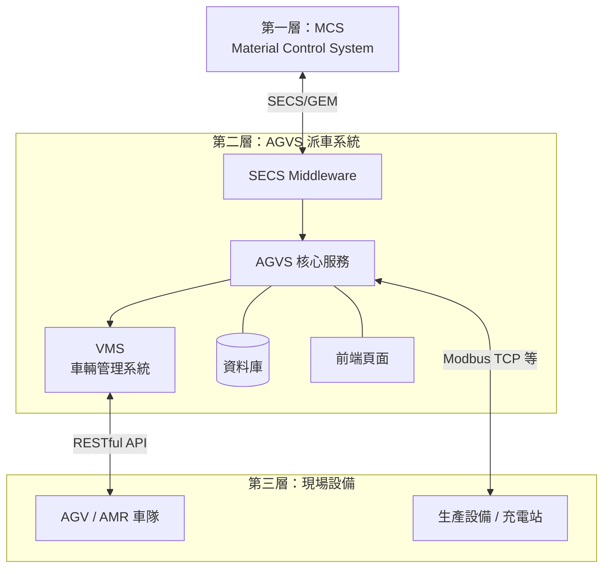
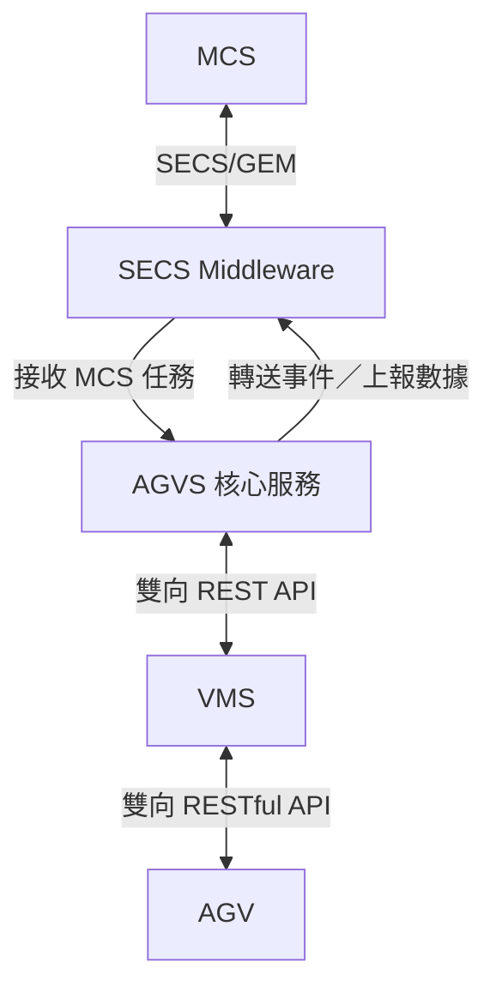

# 系統架構概覽

GPM 派車系統採 **MCS → AGVS → AGV** 三層架構：上位 MCS 下達搬運需求，中層 AGVS 負責任務管理與現場協調，底層 AGV 執行實際搬運。AGVS 本身由多個服務組成，各自負責通訊轉換、業務管理與車輛調度。

## 三層架構

### 各層職責

| 層級 | 組件 | 職責 |
|------|------|------|
| **第一層** | MCS | 上位物料控制，下達搬運／派工需求，接收執行結果 |
| **第二層** | AGVS | 派車系統核心，任務接收與儲存、設備管理、車輛調度 |
| **第三層** | AGV | 現場載具，執行移動與搬運，回報狀態與導航事件 |

---

## AGVS 服務組成

AGVS 派車系統由 **SECS Middleware**、**AGVS 核心服務** 與 **VMS** 三個主要服務協同運作。

### a. SECS Middleware

負責透過 **SECS/GEM** 與 MCS 通訊，是 MCS 與 AGVS 之間的協定轉換層。

| 方向 | 說明 |
|------|------|
| MCS → AGVS | 接收 MCS 任務，轉送給 AGVS |
| AGVS → MCS | 轉送 AGVS 事件、轉拋 AGVS 上報數據至 MCS |

**API 互動方式：**

- **主動呼叫 AGVS API**：將 MCS 下達的任務寫入 AGVS
- **提供 API 供 AGVS 呼叫**：接收 AGVS 產生的事件與上報數據，再轉換為 SECS 訊息回傳 MCS

:::tip 定位
SECS Middleware 不直接管理車輛或設備，專注於 **協定轉換與訊息路由**。
:::

---

### b. AGVS 核心服務

AGVS 為派車系統的**業務核心**，負責任務生命週期管理與現場設備協調。

| 功能 | 說明 |
|------|------|
| 任務管理 | 接收任務（來自 SECS Middleware 或 API）並儲存至資料庫 |
| 前端服務 | Serve 派車系統前端操作頁面 |
| 生產設備管理 | 與客戶端主設備通訊，取得並維護設備狀態 |
| 充電站管理 | 管理充電站狀態，協調 AGV 充電排程 |

AGVS 與 VMS 透過 REST API 協作：AGVS 決定「派什麼任務」，VMS 負責「派給哪台車、如何走」。

---

### c. VMS（Vehicle Management System）

**車輛管理系統**，專責 AGV 層級的通訊、調度與交管。

| 功能 | 說明 |
|------|------|
| 雙向 RESTful 通訊 | 下達任務給 AGV；接收 AGV 狀態上報與導航事件上報 |
| 車輛調度 | 依任務需求選派合適 AGV |
| 交管 | 多車路徑衝突避免、優先權與讓路控制 |

**與 AGV 的通訊內容：**

- **下行**：移動指令、任務指派、取消／暫停
- **上行**：位置、電量、任務進度、導航事件（到站、偏離、障礙等）

:::info 分工原則
- **AGVS**：任務與設備業務邏輯（What & When）
- **VMS**：車輛執行與路徑控制（Who & How）
:::

---

## 服務協作摘要

| 服務 | 對外通訊 | 主要職責 |
|------|----------|----------|
| SECS Middleware | MCS（SECS/GEM）、AGVS（REST API） | 協定轉換、任務與事件轉送 |
| AGVS 核心服務 | SECS Middleware、VMS、前端、主設備 | 任務儲存、設備／充電站管理、前端 |
| VMS | AGVS（REST API）、AGV（RESTful API） | 車輛調度、交管、AGV 雙向通訊 |

---

## 相關文件

:::info 下一步
- 各服務細節請參閱 [模組說明](/docs/architecture/components)
- 現場網路連線請參閱 [網路架構拓樸](/docs/architecture/network-topology)
- 派車流程請參閱 [派車資料流](/docs/architecture/data-flow)
:::
